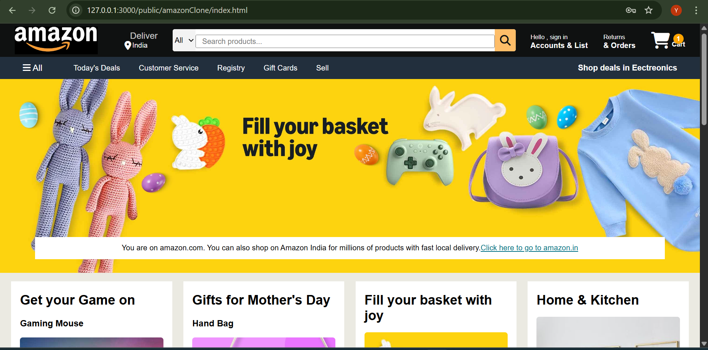
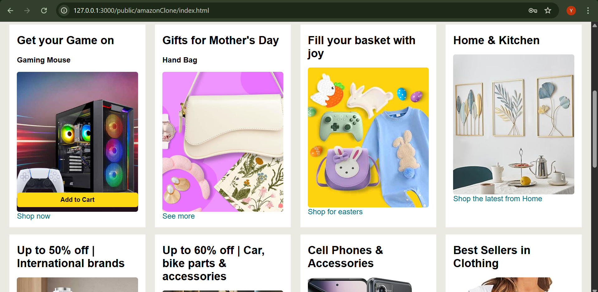
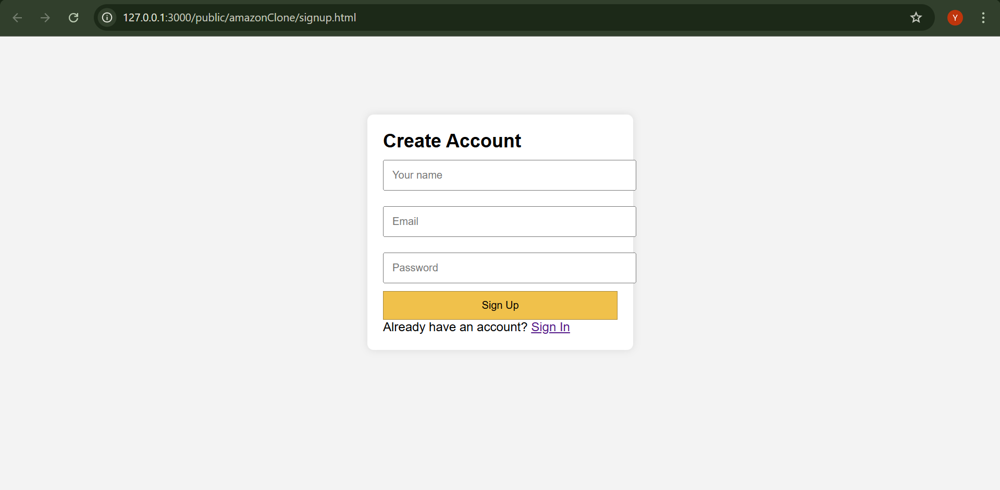
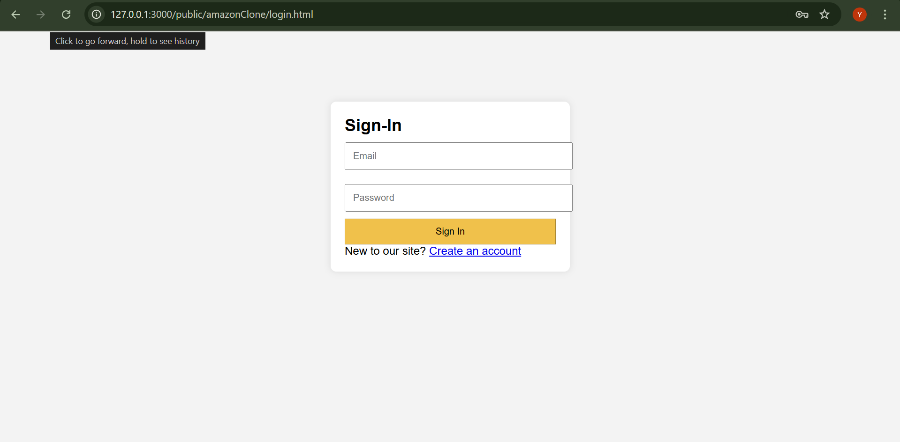
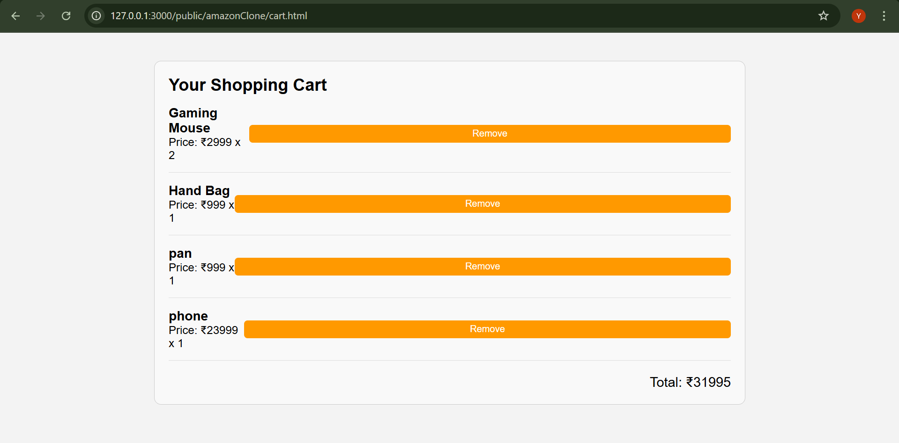

# 🛒 Smart E-commerce Website

A responsive, front-end e-commerce website project inspired by Amazon. Built using **HTML**, **CSS**, and **JavaScript**, it simulates core e-commerce functionality such as product listings, cart management and user authentication — all powered by **localStorage**.

---


## 🎯 Objectives

- Create a user-friendly e-commerce interface using HTML, CSS, and JavaScript.
- Implement login and signup functionality with localStorage.
- Build a dynamic shopping cart with real-time updates.
- Provide a responsive layout.

---

## 🔧 Technologies Used

| Technology       | Purpose                                          |
|------------------|--------------------------------------------------|
| HTML5            | Structure and layout of web pages                |
| CSS3             | Styling and responsive design                    |
| JavaScript       | DOM manipulation, logic, and data handling       |
| LocalStorage     | Store user sessions and cart data locally        |
| VS Code          | Code editor used for development                 |
| Git & GitHub     | Version control and project hosting              |

---

## 🗂️ Folder Structure

Smart-Ecommerce/
├── index.html
├── signup.html
├── login.html
├── cart.html
├── css/
│ └── style.css
├── js/
│ └── script.js
├── images/
├── README.md


---

## ✨ Key Features

- 🛍️ **Home Page** with product grid and 'Add to Cart' buttons  
- 👤 **Signup/Login Pages** with localStorage authentication  
- 🛒 **Cart Page** to view and manage selected items  
- 📱 **Responsive Design** for all screen sizes  

---

## 🚀 How to Run

1. Clone the repository:
   ```bash
   git clone https://github.com/Yatharth258/E-Commerce.git

2. Open signup.html in any modern web browser:
    start signup.html
(or just double-click the file)

 No backend or server setup required — everything runs locally in the browser.

---

## 🖼️ Screenshots

Home Page







Signup Page





Login Page





Cart Page




---

## 📚 Learning Outcomes
1. Practical understanding of structuring and styling webpages

2. Hands-on experience in implementing client-side authentication

3. Knowledge of localStorage for data persistence

4. Building interactive UI with DOM manipulation

---

## 🚧 Future Enhancements
Backend integration using Node.js + Express

MongoDB database for real user/product storage

Payment gateway integration

Product reviews & user order history

Admin dashboard to manage products

---